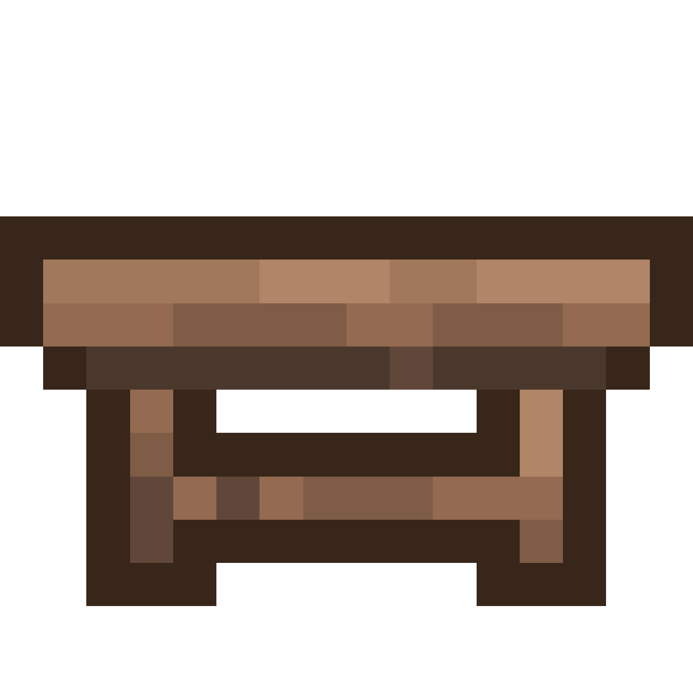

# TerraWorkbench
**A tool for browsing Terraria recipes and planning crafting**

## ⚡ Features
- **Terraria recipe browser with advanced search capability**
- **Detailed view for recipes and items**
- **Calculator for planning bulk crafts and resource management**
- **Advanced options like modded recipes**

## 🤝 Contributing
**To contribute to this project:**

1. Clone it with `git clone https://github.com/realpalmforest/terra-workbench.git`
2. Install node modules with `npm install`
3. Modify the project and test by running `npm run dev`

**Finally create a pull request to this repository!**